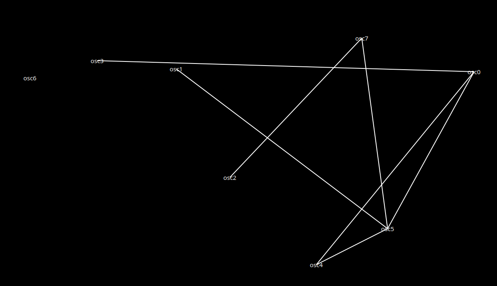

# Oscilador caósmico

El *Oscilador caósmico* es una pieza, programada en SuperCollider, que forma parte de mi tesis de licenciatura llamada "Una lucha por la redistribución del futuro: escuchas fabulativas y otras especulaciones para transitar al Fonoceno". 

### Ejecutar la pieza

Primero debes descargar el archivo Oscilador_caosmico.scd, abrirlo en un IDE y compilarlo. Es recomendable crear una carpeta propia para el archivo .scd ya que, cuando lo ejecutes, el programa creará una serie de carpetas en el directorio desde donde se ejecute.  

Al compilar el código se mostrará una ventana en pantalla completa. En el menú desplegable de la izquierda puedes elegir la escala con la que se ejecutará el programa.

Con el botón "iniciar" el programa comenzara a ejecutar lo necesario para funcionar. Una vez que presiones este botón, aparecerá en la pantalla un diagrama de conexión entre los osciladores. Debes presionar el botón "iniciar" antes que el botón "tocar".

Al presionar  el botón "tocar" el ecosistema de osciladores empezará a sonar y se mostrarán las formas de onda resultantes en superposición XY.

¡Espero la disfrutes! 